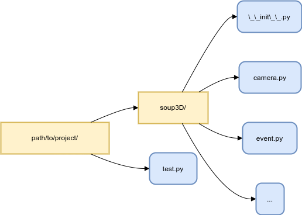

这是一个基于`OpenGL`和`pygame`开发的3D引擎，易于新手学习，可  
用于3D游戏开发、数据可视化、3D图形的绘制等开发。

## 安装

如果您的`python`环境中包含`pip`，可使用如下代码进行安装：

```bash
pip install -i https://osoup.top/simple soup3D
```

## 小试牛刀

安装完成后，您可以试试这段代码：

```python
"""
这是一段最简单的soup3D使用案例，展示了如何用soup3D配合pygame显示出一个最简单的三角形
"""
import soup3D
from soup3D.name import *
import pygame


running = True


if __name__ == '__main__':
    width, height = 1920, 1080
    pygame.init()                                                            # 初始化pygame
    pygame.display.set_caption("soup3D")                                     # 设置pygame窗口标题
    pygame.display.set_mode((1920, 1080), pygame.DOUBLEBUF | pygame.OPENGL)  # 将pygame窗口作为OpenGL容器
    soup3D.init(bg_color=(0.5, 0.75, 1), width=1920, height=1080)            # 初始化soup3D

    green = soup3D.shader.FPL(soup3D.shader.MixChannel((1, 1), 0, 1, 0))  # 创建绿色材质
    face = soup3D.Face(TRIANGLE_B, green, [                               # 创建面
        (0, 0, 0, 0, 0),  # (X, Y, Z, U, V)
        (100, 0, 0, 0, 0),
        (0, 100, 0, 0, 0)
    ]*1000)

    triangle = soup3D.Model(0, 0, -500, face)  # 将面加入模型
    triangle.show()                            # 显示模型
    while running:  # 主循环
        soup3D.update()  # 更新soup3D画面
        pygame.display.flip()  # 更新pygame画面
        for event in pygame.event.get():  # 遍历pygame事件
            if event.type == pygame.QUIT:  # pygame窗口关闭事件
                pygame.quit()  # 关闭窗口
                running = False  # 退出循环

```

这段代码运行后，您可以看到一个绿色三角形在窗口中

## 协作开发

由于个人开发能力有限，我们非常欢迎志同道合的人们一同开发此项目。但为了方便代码管理，请先了解我们的开发目的及代码规范

- **开发目的**
  
  开发该项目的目的是创建一个易于上手的同时又具备一定专业性的3D渲染引擎。让具备python开发经验的用户可以以更加符合他们习惯的方式开发3D应用。
  
- **代码规范**
  
  更具如下规范进行开发，可以让您的代码拥有更大的概率被我们征用
  
  1. 所有的函数、类、类成员函数等都需要拥有`Google` 风格的 `docstring` 格式注释
    
  2. 自行经过测试后再进行pr提交，测试方法请参考下方`功能测试`部分
    
  3. 需要开发某个模块之前，先与作者确认需求
  
  4. 新功能尽量不影响老功能的调用方式
    
- **功能测试**
  
  开发完成后，可通过如下方式进行功能测试
  
  1. 更具如下结构创建测试环境   
     
  
  2. 在`.../project/test.py`中编辑测试代码，测试您编写的各项功能
  
  3. 运行`.../project/test.py`，可以正常运行，则测试成功

## 更多内容

该库还有很多的方法供您使用，更多内容可参阅[帮助文档](./help.md)